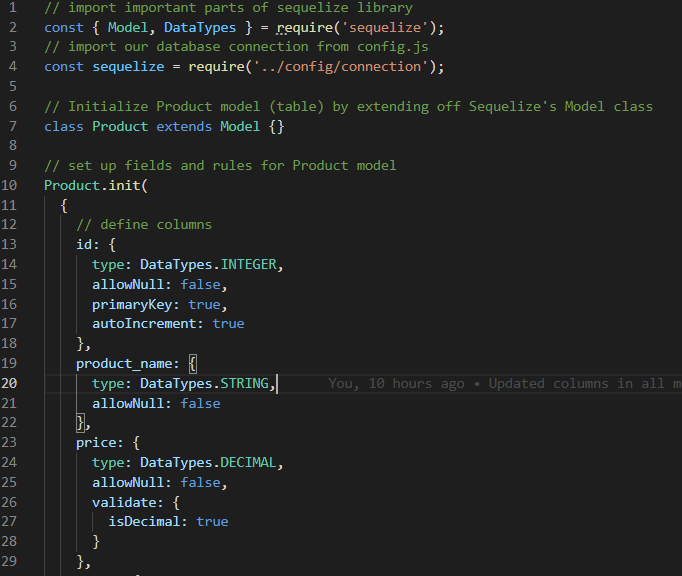

# zpl-ecommerce-site-1

## User Story
AS A manager at an internet retail company
I WANT a back end for my e-commerce website that uses the latest technologies
SO THAT my company can compete with other e-commerce companies

## Acceptance Criteria

GIVEN a functional Express.js API
WHEN I add my database name, MySQL username, and MySQL password to an environment variable file
THEN I am able to connect to a database using Sequelize
WHEN I enter schema and seed commands
THEN a development database is created and is seeded with test data
WHEN I enter the command to invoke the application
THEN my server is started and the Sequelize models are synced to the MySQL database
WHEN I open API GET routes in Insomnia for categories, products, or tags
THEN the data for each of these routes is displayed in a formatted JSON
WHEN I test API POST, PUT, and DELETE routes in Insomnia
THEN I am able to successfully create, update, and delete data in my database

  ## Description

  Provide a short description explaining the what, why, and how of your project. Use the following questions as a guide:
  
  - What was my motivation? I wanted to create the back end for an e-commerce website that uses the latest technologies so a company could use it to compete with other e-commerce companies.
  - Why did I build this project? I built this project to test my skills with Object-Relational Mapping (ORM) by taking a working Express.js API and configuring it to use Sequelize to interact with a MySQL database.
  - What problem does it solve? It solves the problem of needing to understand fundamental architecture of what an e-commerce site looks like under the hood (back end).
  - What did I learn? I learned how to take an existing Express.js API and refactor it to utilize Sequelize to interact with a MySQL database.
  - What makes my project stand out? My model files are very readable and easy to understand.
  
  
  ## Table of Contents (Optional)
  
  If your README is long, add a table of contents to make it easy for users to find what they need.
  
  - [Description](#description)
  - [Credits](#credits)
  - [License](#license)

  ## Usage

  Provide instructions and examples for use. Include screenshots as needed.
  
  To add a screenshot, create an assets/images folder in your repository and upload your screenshot to it. Then, using the relative filepath, add it to your README using the following syntax:

  md
  
  
  ## Credits
  
  None.

  ## License

  No license.

  ---

  ## Questions?
  If you have any questions, check out my [GitHub profile](https://github.com/zachary-levin) at or email me at [zlevin706@gmail.com](mailto:zlevin706@gmail.com)
